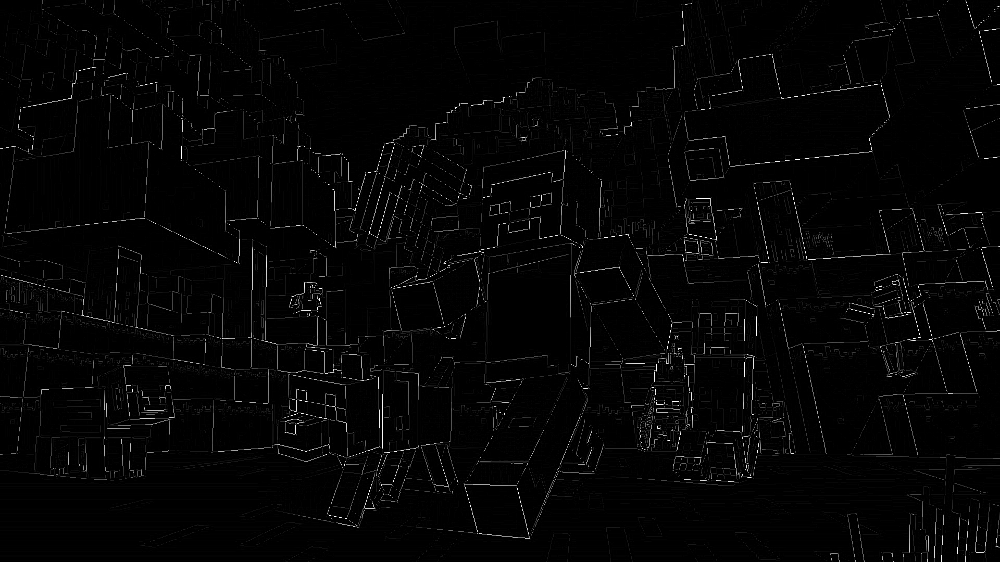
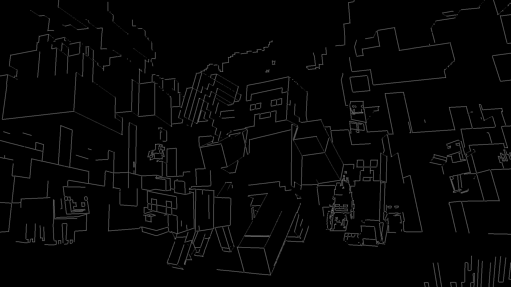

# cpp_imageproc

A simple C++20 implementation of the Canny Edge Detection algorithm, built from scratch without external libraries.
The project demonstrates core image processing techniques — Gaussian blur, Sobel gradients, non-maximum suppression, and hysteresis thresholding — in a clean, modular way.

## Features

- PPM (P6) image loading/saving in grayscale

- FloatImage abstraction for intermediate floating-point computations

- Gaussian blur with separable 1D convolution

- Sobel operator to compute gradient magnitudes and directions

- Non-maximum suppression (NMS) for edge thinning

- Double thresholding + hysteresis for clean, continuous edges

## Build

### Requirements
```
CMake ≥ 3.16

A C++20 compiler (Clang, GCC, or MSVC)
```

### Steps
```
git clone https://github.com/haorangan/cpp_imageproc.git
cd cpp_imageproc
mkdir build && cd build
cmake ..
cmake --build .
```

This produces a binary `cpp_imageproc`, which you can run in the command line with:
```
./cpp_imageproc <input.ppm> <output.ppm>
```

## Example Run
Running the above steps will produce the following PPM images in the `data/` directory.

### Original Image


### Grayscale + Gaussian Blur


### Sobel operator computation


### After NMS


### Double thresholding + hysteresis



